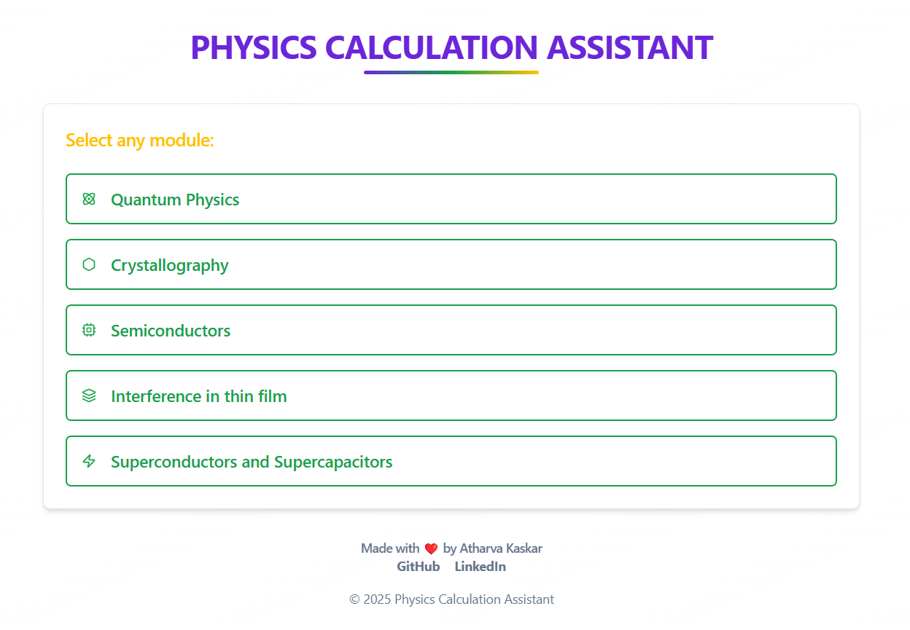

# Physics Calculation Assistant 🔬⚛️

## Hosted Application 🌐

Access the live version of Physics Calculation Assistant is here: 
https://physics-calculation-assistant.vercel.app/

## Introduction
<table>
  <tr>
    <td style="text-align: left; vertical-align: top;">
      <h1>Physics Calculation Assistant</h1>
      <p>
        Physics Calculation Assistant is a web application designed to provide easy-to-use calculation tools for various fields of physics. The app helps with important calculations in quantum physics, crystallography, semiconductors, thin films, and superconductors. It includes modules to compute the De-Broglie wavelength, energy levels, X-ray wavelength, and many more critical physical parameters.
      </p>
      <p>
        This tool simplifies complex calculations for students, researchers, and professionals in physics and related fields.
      </p>
    </td>
    <td style="text-align: right; vertical-align: top;">
      
    </td>
  </tr>
</table>

## Features🚀 

- Advanced Physics Calculations: Perform a variety of calculations like De-Broglie wavelength, energy/momentum, interplanar distance, X-ray wavelength, resistivity, and more.

- User-Friendly Interface: The app is designed with a simple, intuitive interface for seamless use.

- Real-Time Calculation Results: Instant feedback for complex physics problems, with real-time results.

- Scalable: The app can easily be expanded to cover more areas in physics as the need grows.


## Tech Stack 📦

1. Frontend/UI:
<br> - Vite ⚡️ for building the fast, modern web application.
<br> - React ⚛️ for the dynamic and interactive user interface.
<br> - Tailwind CSS 🎨 for sleek, responsive styling. 

3. Backend Calculation Logic:
<br> - TypeScript 🛠️ for type-safe and robust calculation logic.

4. UI Component Library::
<br> - shadcn-ui for stylish, reusable UI components.


## Installation and Setup 💻🔧

1. Prerequisites
Node.js (version 14 or later)
<br> npm (Node package manager)

2. Steps to Run Locally
   ```bash
   git clone https://github.com/Atharva-Kaskar-45/Sehat-AI 
   cd physics-calculation-assistant

4. Install Dependencies:
   ```bash
   npm install

5. Run the Application:
   ```bash
   npm run dev

## Screenshots

 <br>

  <br>

  <br>

## Contributing 🧑‍💻
We welcome contributions to improve Sehat AI! To contribute, follow these steps:
1. Fork the repository.

2. Create a new branch for your feature or bug fix:
   ```bash
   git checkout -b feature-name


4. Commit your changes and push them to your fork.

5. Open a pull request to merge your changes into the main repository.

## License 🔐
This project is licensed under the MIT License.

## Inspiration 💡
Physics Calculation Assistant was created to make complex physics calculations more accessible and less time-consuming for students, professionals, and researchers. It aims to bridge the gap between complicated formulas and practical use by providing easy-to-use, accurate tools.

## Contact 📫
For any questions, suggestions, or collaborations, feel free to reach out:

- Email: atharvakaskar45@gmail.com
- GitHub: https://github.com/Atharva-Kaskar-45
- LinkedIn: https://www.linkedin.com/in/atharva-kaskar-00114324a/
